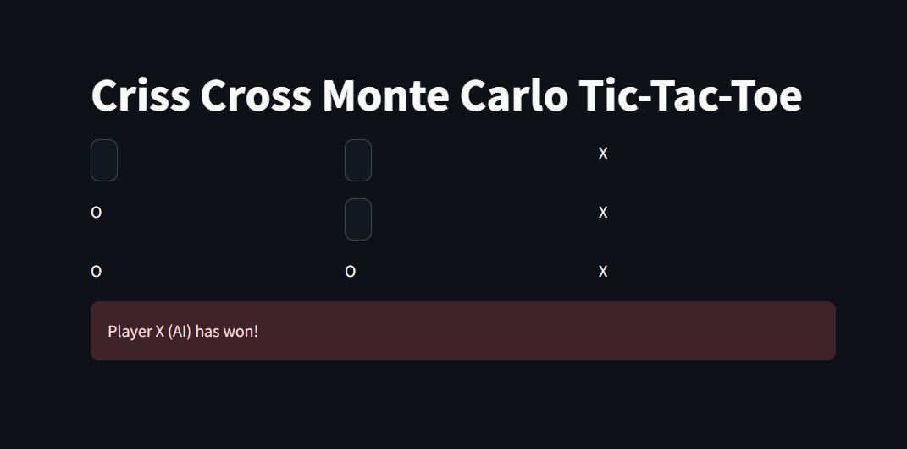

# MCTS-Tic-Tac-Toe

Welcome to the **MCTS-Tic-Tac-Toe** project! This is a web-based application where you can play Tic-Tac-Toe against an AI opponent that uses the Monte Carlo Tree Search (MCTS) algorithm. The AI performs multiple simulations to select the best possible move, giving you a challenging game.

## Features
- Play Tic-Tac-Toe interactively through your browser.
- AI opponent powered by Monte Carlo Tree Search.
- Streamlit-based web interface.
- Real-time move evaluation and visualization.

## How It Works
The AI uses the Monte Carlo Tree Search (MCTS) algorithm to play Tic-Tac-Toe. It performs the following steps for each move:
1. **Simulate**: Randomly plays out multiple games from the current game state.
2. **Evaluate**: Each simulation is evaluated to see which move leads to the best outcome.
3. **Accumulate**: Scores are accumulated for each possible move.
4. **Select**: The move with the highest score is chosen as the AI's next move.

## Tech Stack
- **Python**: Game logic and AI implementation.
- **Streamlit**: For building the web interface.
- **Monte Carlo Tree Search**: Used for AI decision-making.

## Installation
1. Clone the repository:
    ```bash
    git clone https://github.com/PhenomSG/MCTS-Tic-Tac-Toe.git
    ```
2. Navigate to the project directory:
    ```bash
    cd MCTS-Tic-Tac-Toe
    ```
3. Install the required dependencies:
    ```bash
    pip install streamlit
    ```
4. Run the application:
    ```bash
    streamlit run tic_tac_toe_app.py
    ```

## How to Play
1. After launching the application, you will be presented with a 3x3 Tic-Tac-Toe board.
2. You play as **Player O**. Click on any empty cell to make your move.
3. The AI, playing as **Player X**, will make its move after yours.
4. Continue playing until one player wins or the game ends in a draw.

## Example Gameplay



## Future Improvements
- Adding difficulty levels by adjusting the number of simulations.
- Implementing a larger board or different game variations.
- Adding a more sophisticated evaluation function for MCTS.

## License
This project is licensed under the [MIT License](LICENSE)
